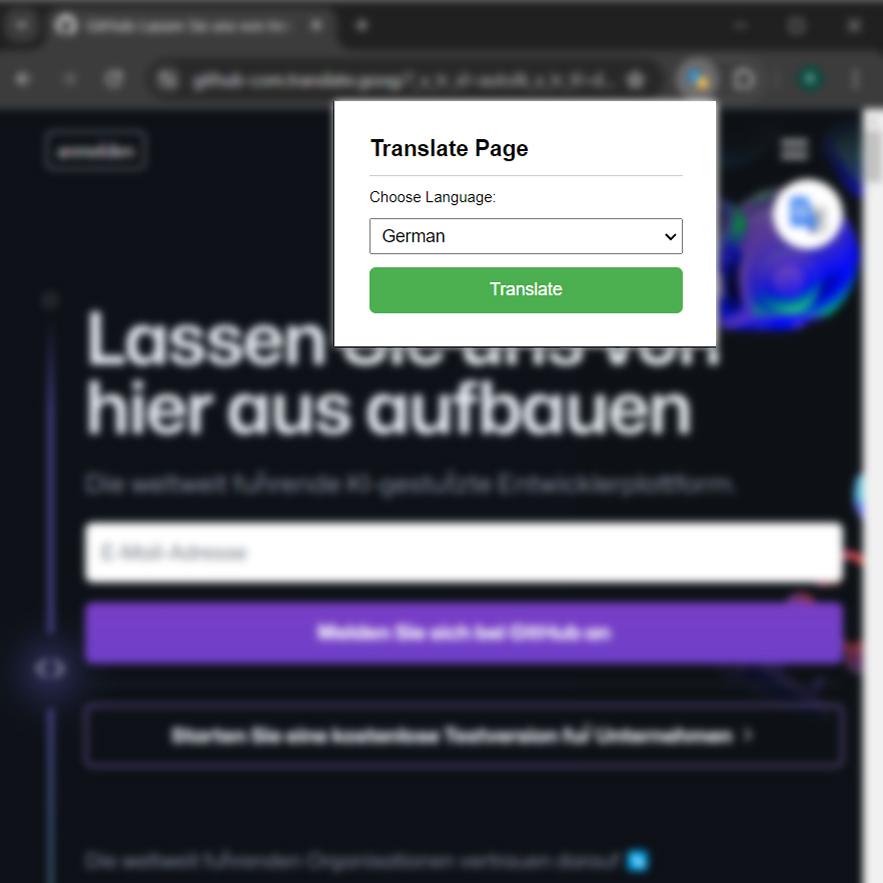

# Traducir: Chrome Extension for Page Translation

## Overview

**Traducir** is a Chrome extension designed to seamlessly translate entire web pages into different languages. Built with a focus on user experience and efficiency, this extension provides an intuitive interface for translating text on-the-fly using reliable translation APIs.



## Technologies Used

- **HTML/CSS**: For designing the extension popup and creating a clean, user-friendly interface.
- **JavaScript**: To handle user interactions, manage translation requests, and dynamically inject translations into web pages.
- **Chrome Extensions API**: Utilized to integrate the extension with the browser's functionality and manage permissions.
- **Translation APIs**: Integrated with services like Google Translate or similar to ensure accurate and reliable translations.

## Features

- **Page Translation**: Translate entire web pages with a single click.
- **Intuitive Popup Interface**: Clean and user-friendly popup designed with HTML and CSS.
- **Seamless Integration**: Inject translations directly into the current web page.
- **Language Selection**: Easily choose the target language for translation.

## Installation

1. Clone this repository:
    ```bash
    git clone https://github.com/vwdr/Traducir.git
    ```
2. Open Chrome and navigate to `chrome://extensions/`.
3. Enable "Developer mode" by toggling the switch in the top-right corner.
4. Click on "Load unpacked" and select the extension directory.

## Usage

1. Click on the extension icon in the Chrome toolbar.
2. Select the target language from the dropdown menu.
3. Click the "Translate" button to translate the current page.

## Development

### Setting Up the Extension

1. **Manifest File**: The `manifest.json` file defines the extension's metadata, permissions, and background scripts. This setup is crucial for defining the extension’s behavior and permissions.

2. **Popup Design**: Created using HTML and CSS to ensure a clean and intuitive user interface. The popup includes input fields for language selection and a button for triggering translations.

3. **JavaScript Implementation**: Developed scripts to handle translation requests. This involves capturing user input, sending requests to the translation API, and injecting the translated content into the current web page.

4. **API Integration**: Integrated with a translation API to provide accurate translations. This required handling API requests, parsing responses, and managing error cases.

### Challenges

- **API Rate Limits**: Dealt with restrictions imposed by translation APIs, which required implementing efficient request handling and caching mechanisms.
- **Cross-Origin Requests**: Managed permissions and configurations to handle cross-origin requests when injecting translated content.
- **UI/UX Design**: Ensured the popup interface was responsive and user-friendly across different screen sizes and resolutions.

## Future Improvements

- **Support for More Languages**: Expand the number of supported languages and translation services.
- **Enhanced Error Handling**: Improve error handling for API failures and network issues.
- **User Preferences**: Implement a feature to save user preferences for language settings.

## Contributing

Contributions are welcome! Please fork the repository and submit a pull request with your changes. For bug reports or feature requests, open an issue on GitHub.

## License

This project is licensed under the MIT License - see the [LICENSE](LICENSE) file for details.
